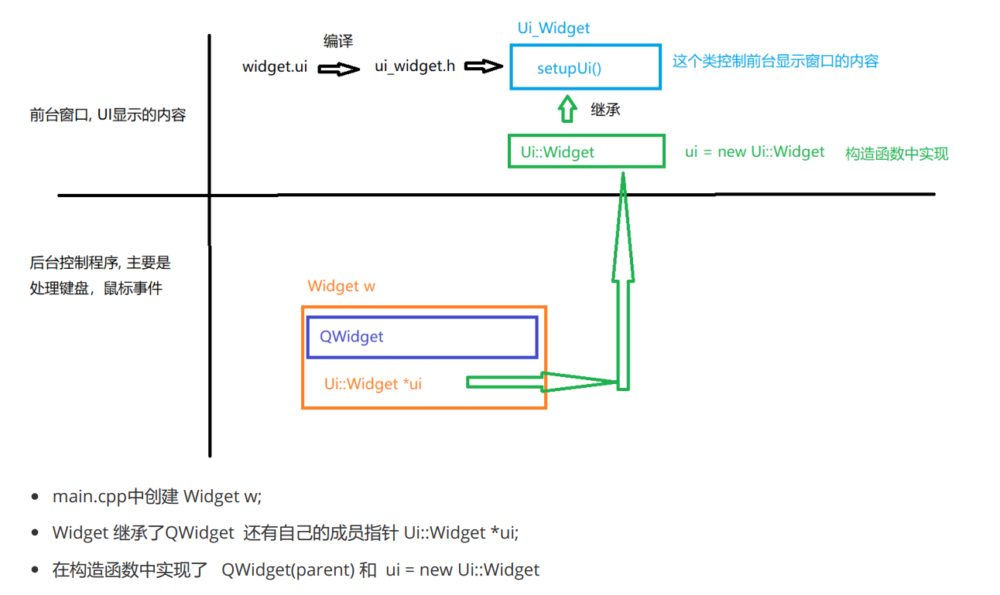
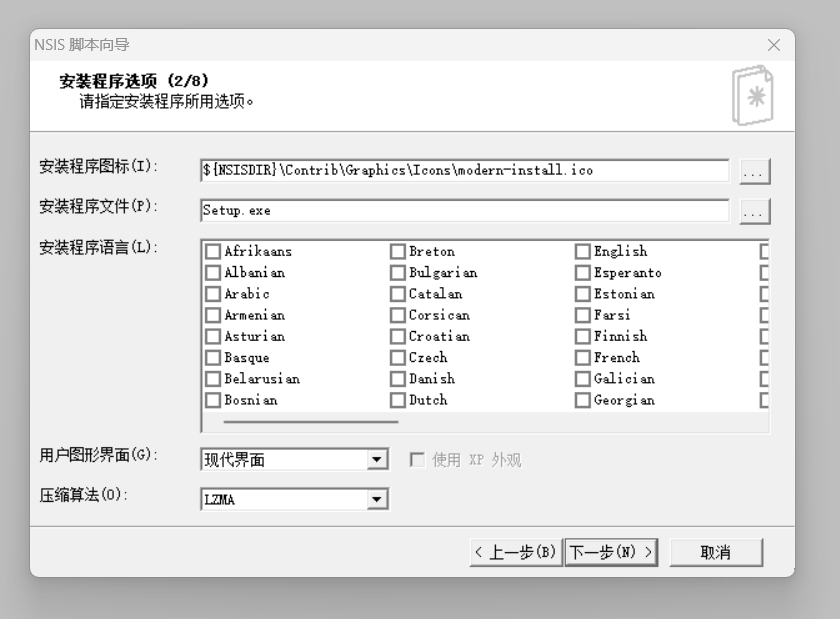
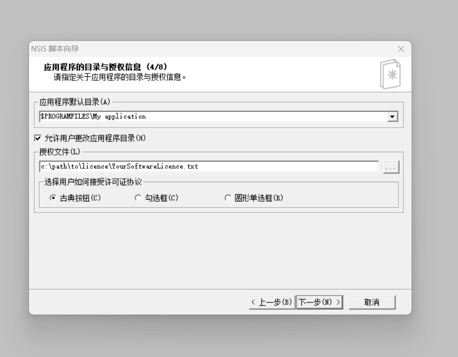
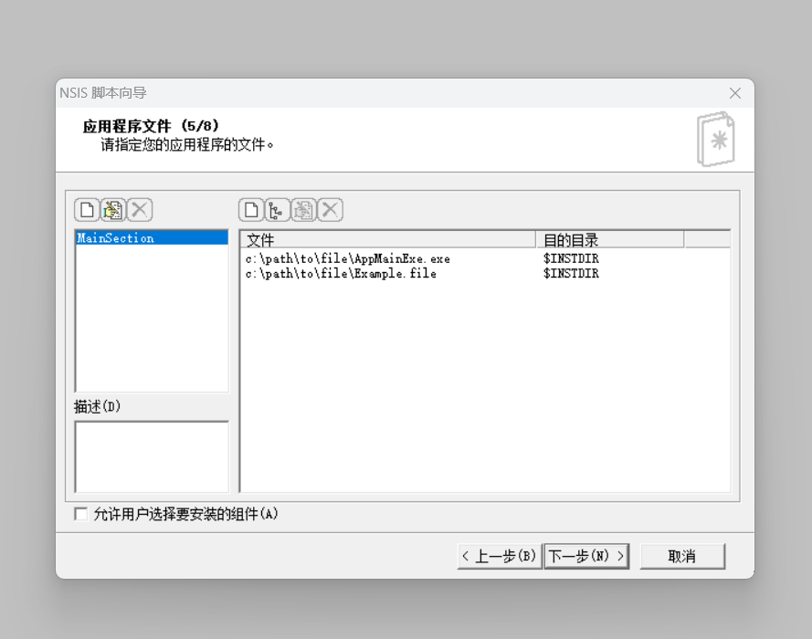

## QT

### QT 是一个跨平台的 C++ 应用程序开发框架 
### 主要特点
- 1. 跨平台性: QT 可以在多种操作系统上运行，包括 Windows、 macOS、 Linux、 Android 和 iOS 等。这使得开发者可以编写一次代码，然后在不同的平台上进行编译和部署，大大提高了开发效率。无论在哪个平台上， QT 都能提供一致的用户界面和功能，确保应用程序在不同操作系统上具有相似的外观和行为
- 2. 丰富的功能库: QT 提供了大量的类库和工具，涵盖了图形用户界面（GUI）设计、网络编程、数据库访问、多线程处理等各个方面 例如， QT 的 GUI 库提供了丰富的控件和布局管理器，使开发者能够轻松创建美观、易用的用户界面。网络库则支持各种网络协议，方便进行网络通信开发。
- 3. 强大的图形界面设计: QT Creator 是 QT 提供的集成开发环境（IDE），其中包含了可视化的界面设计工具 Qt Designer。通过 Qt Designer，开发者可以通过拖拽控件、设置属性等方式快速设计用户界面，然后生成相应的 C++ 代码。这大大简化了 GUI 开发的过程。
- 4. 信号与槽机制: QT 引入了信号与槽（Signals and Slots）机制，用于实现对象之间的事件通信。当一个特定的事件发生时，一个对象可以发出一个信号。其他对象可以连接到这个信号，并在接收到信号时执行相应的槽函数。这种机制使得代码的耦合度降低，提高了代码的可维护性和可扩展性

### 运行关系

### 打包程序
#### 在对应的终端（MSVC\MinGW）执行windeployqt *.exe

### 制作安装包
#### nsis
- 1. 设置软件图标

- 2. 编写授权文件

- 3. 打包程序目录

### 图片转换工具

